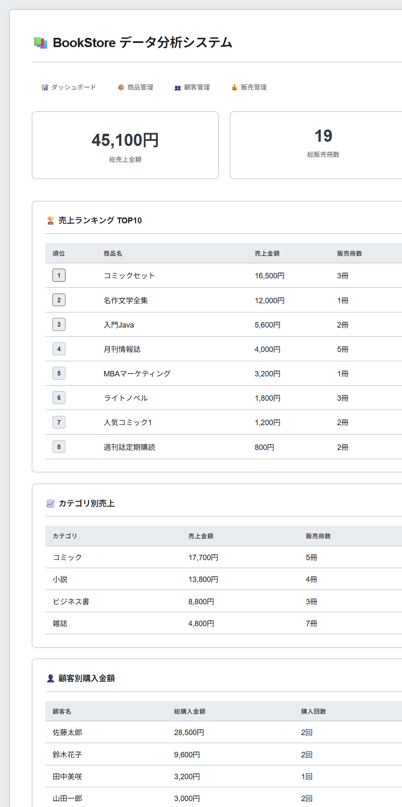
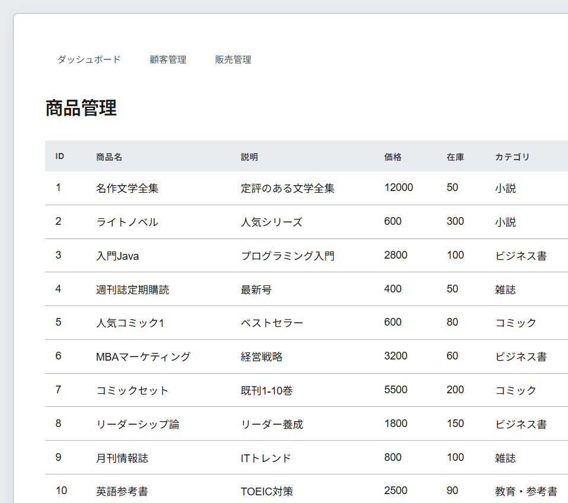
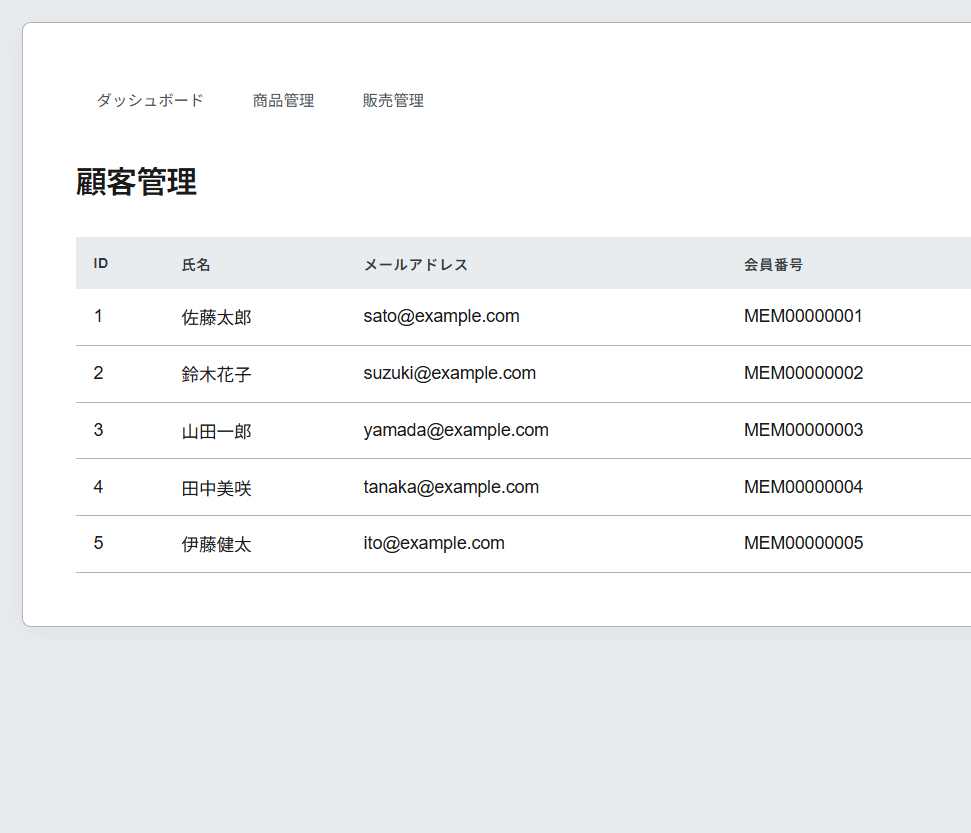
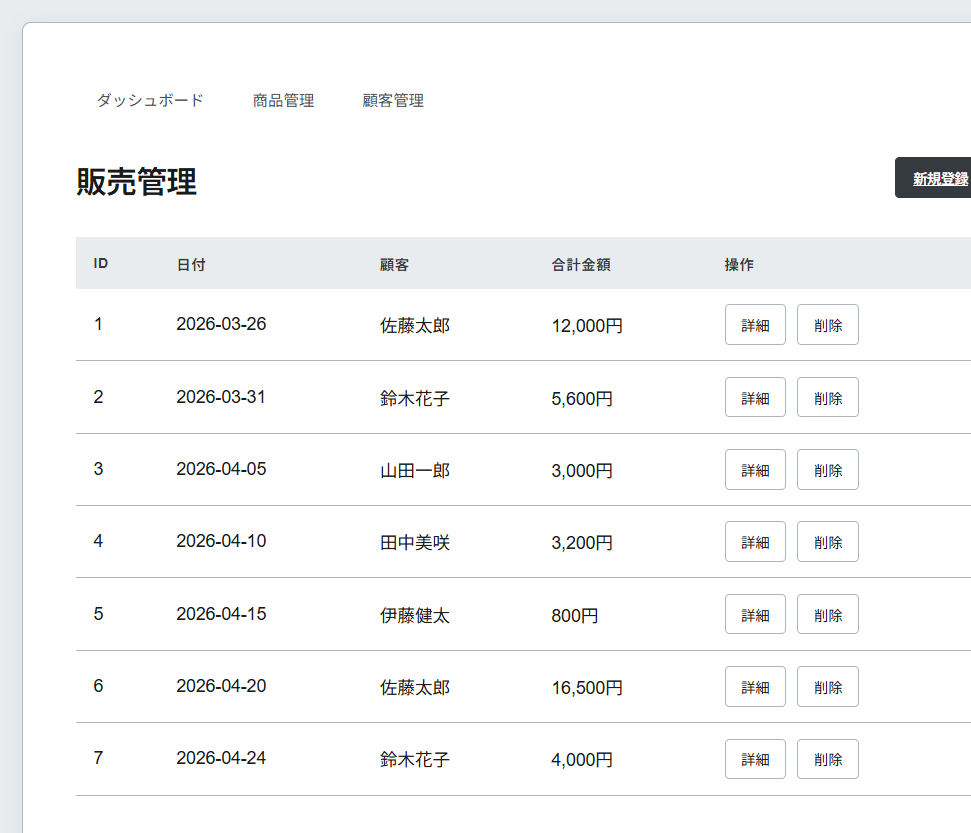
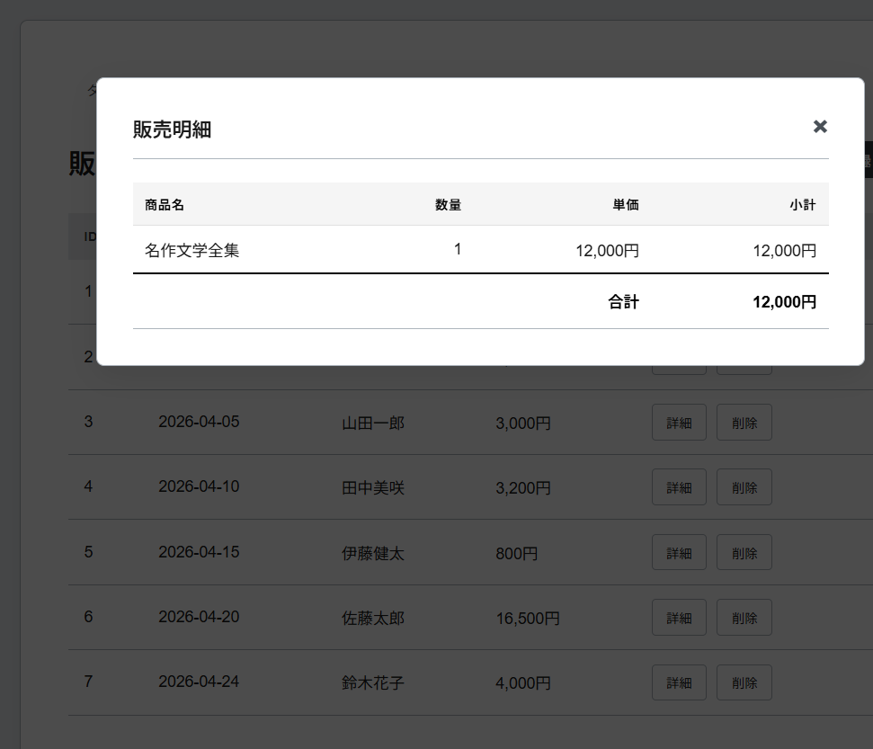
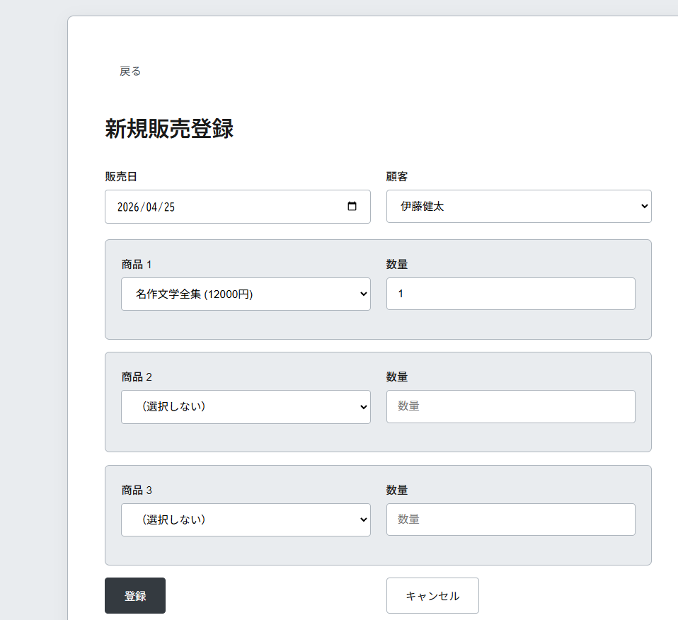

# BookStore - 商品販売データ分析システム

書籍店舗の商品販売データを収集・分析し、売上状況を可視化するWebアプリケーション。

## 概要

小売業の店舗管理者や販売データの分析担当者を対象とした、商品販売データの管理・分析システム。ダッシュボードでの売上可視化、商品・顧客管理、販売データの登録・閲覧機能を提供します。

## 主な機能

| 機能 | 説明 |
|------|------|
| 📊 **ダッシュボード** | 売上ランキング、カテゴリ別集計、顧客別分析を一括表示 |
| 📚 **商品管理** | 商品マスタの閲覧（在庫管理対応） |
| 👥 **顧客管理** | 顧客マスタの閲覧 |
| 💰 **販売管理** | 販売データの登録・閲覧（ヘッダーー明細構造） |

## 技術スタック

| 層 | 技術 | バージョン |
|----|------|-----------|
| 言語 | Java | 21 |
| フレームワーク | Spring Boot | 3.3.4 |
| ORM | Spring Data JPA | - |
| データベース | SQLite | 3.46.0.0 |
| テンプレートエンジン | Thymeleaf | - |
| ビルドツール | Maven | - |

## 開発環境

**開発ツール:**
- **IDE**: Eclipse（Mavenプロジェクトとしてインポート）
- **AIアシスタント**: Claude Code CLI + GLM 4.7

**開発プロセス:**
- Eclipse でのプロジェクト作成・デバッグ
- Claude Code CLI によるコード生成・レビュー・ドキュメント作成
- Git によるバージョン管理

## アーキテクチャ

### レイヤードアーキテクチャ

```
┌─────────────────────────────────────────────────────────┐
│                      Browser                             │
│                   (Thymeleaf UI)                         │
└────────────────────┬────────────────────────────────────┘
                     │ HTTP Request
                     ▼
┌─────────────────────────────────────────────────────────┐
│                    Controller Layer                      │
│  ┌──────────┐  ┌──────────┐  ┌──────────┐  ┌─────────┐ │
│  │   Main   │  │ Product  │  │ Customer │  │  Sale   │ │
│  └──────────┘  └──────────┘  └──────────┘  └─────────┘ │
└────────────────────┬────────────────────────────────────┘
                     │
                     ▼
┌─────────────────────────────────────────────────────────┐
│                     Service Layer                        │
│  ┌──────────┐  ┌──────────┐  ┌──────────┐  ┌─────────┐ │
│  │ Product  │  │ Customer │  │SaleHeader│  │   Sale  │ │
│  │ Service  │  │ Service  │  │ Service  │  │ Service │ │
│  └──────────┘  └──────────┘  └──────────┘  └─────────┘ │
└────────────────────┬────────────────────────────────────┘
                     │
                     ▼
┌─────────────────────────────────────────────────────────┐
│                   Repository Layer                       │
│  ┌──────────┐  ┌──────────┐  ┌──────────┐  ┌─────────┐ │
│  │ Product  │  │ Customer │  │SaleHeader│  │   Sale  │ │
│  │   Repo   │  │   Repo   │  │   Repo   │  │  Repo   │ │
│  └──────────┘  └──────────┘  └──────────┘  └─────────┘ │
└────────────────────┬────────────────────────────────────┘
                     │ JPA / Hibernate
                     ▼
┌─────────────────────────────────────────────────────────┐
│                    SQLite Database                       │
└─────────────────────────────────────────────────────────┘
```

### パッケージ構成

```
com.example.bookstore/
├── config/          # 設定クラス
│   ├── CustomSQLiteDialect.java    # SQLite方言設定
│   └── DataInitializer.java        # サンプルデータ生成
├── controller/      # コントローラー（HTTPリクエスト処理）
├── dto/            # データ転送オブジェクト（集計用）
├── entity/         # エンティティ（DBテーブル対応）
├── repository/     # リポジトリ（データアクセス）
└── service/        # サービス（ビジネスロジック）
```

### 各層の役割

#### Controller（プレゼンテーション層）
ユーザーからのHTTPリクエストを受け取り、適切な処理を振り分けます。画面遷移の制御や、Serviceから受け取ったデータをThymeleafテンプレートに渡してHTMLを生成します。

**役割:**
- HTTPリクエストの受信（GET/POST）
- パラメータのバリデーション
- Service層の呼び出し
- ビュー（HTML）の返却

#### Service（ビジネスロジック層）
アプリケーションの中心的な処理を行います。Repositoryからデータを取得・加工し、業務ルールを適用します。トランザクション管理もこの層で行います。

**役割:**
- ビジネスロジックの実装
- 複数Repositoryの連携
- トランザクション管理（@Transactional）
- エンティティの保存・更新・削除

#### Repository（データアクセス層）
データベースへのアクセスを担当します。Spring Data JPAによって、メソッド名から基本的なSQLを自動生成できます。

**基本的なSQL操作（実装済み）:**

| やりたいこと | SQL | Repository（Java） | 対応するソース |
|-------------|-----|-------------------|---------------|
| IDで商品を探す | `SELECT * FROM products WHERE id = ?` | `findById(1L)` | `JpaRepository`から継承 |
| 全商品を取得 | `SELECT * FROM products` | `findAll()` | `JpaRepository`から継承 |
| 名前で検索 | `SELECT * FROM products WHERE name LIKE ?` | `findByNameContaining("Java")` | [↓コード例1] |
| 在庫不足を探す | `SELECT * FROM products WHERE stock < ?` | `findByStockLessThan(10)` | [↓コード例2] |
| 新規登録 | `INSERT INTO products ...` | `save(newProduct)` | `JpaRepository`から継承 |
| 更新 | `UPDATE products SET ...` | `save(existingProduct)` | `JpaRepository`から継承 |
| 削除 | `DELETE FROM products WHERE id = ?` | `deleteById(1L)` | `JpaRepository`から継承 |

**実際のソースコード:**

```java
// bookstore/src/main/java/com/example/bookstore/repository/ProductRepository.java

@Repository
public interface ProductRepository extends JpaRepository<Product, Long> {

    // [コード例1] 名前で検索（部分一致）
    // 自動生成されるSQL: SELECT * FROM products WHERE name LIKE ?
    List<Product> findByNameContaining(String name);

    // [コード例2] 在庫不足を探す
    // 自動生成されるSQL: SELECT * FROM products WHERE stock < ?
    List<Product> findByStockLessThan(Integer stock);
}
```

**💡 ポイント: メソッド名を書くだけで、Spring Data JPAがSQLを自動生成します。**

**SQL自動生成の仕組み:**

```
メソッド名: findByNameContaining
           ↓
Spring Data JPAが解析
           ↓
┌─────────────────────────────────┐
│ find = SELECT文を生成            │
│ By = WHERE句の開始               │
│ Name = WHERE name                │
│ Containing = LIKE を使用         │
└─────────────────────────────────┘
           ↓
生成されるSQL: SELECT * FROM products WHERE name LIKE ?
```

**例:**
- `findByStockLessThan(10)` → `WHERE stock < 10`
- `findByNameContaining("Java")` → `WHERE name LIKE '%Java%'`
- `findById(1L)` → `WHERE id = 1`

**メソッド名のルール:**
| プレフィックス | 意味 | 例 |
|-------------|------|-----|
| `findBy` | WHERE句で検索 | `findByName()` |
| `countBy` | 件数をカウント | `countByStock()` |
| `existsBy` | 存在チェック | `existsByName()` |
| `deleteBy` | 削除 | `deleteByExpired()` |

---

**具体例: 顧客一覧画面のデータ取得**

```
1. ユーザーが「顧客管理」をクリック
   ↓
2. Controllerが呼ばれる
   @GetMapping
   public String list(Model model) {
       model.addAttribute("customers", customerService.findAll());
       return "customers";
   }
   ↓
3. ServiceがRepositoryを呼ぶ
   public List<Customer> findAll() {
       return customerRepository.findAll();
   }
   ↓
4. Spring Data JPAがSQLを自動生成
   findAll() → SELECT * FROM customers
   ↓
5. データベースから全顧客を取得
   ↓
6. 画面（customers.html）に表示
```

**実際のソースコード:**
- Controller: `CustomerController.java`（40行目）
- Service: `CustomerService.java`（39行目）
- Repository: `CustomerRepository.java`（`JpaRepository`を継承）

**💡 ポイント:**
- メソッド名からSQLを自動生成（`findByStockLessThan` → `WHERE stock < ?`）
- `JpaRepository`を継承するだけで基本的なCRUDが使える
- SQLを直接書かずに型安全なデータアクセスが可能

**応用（分析クエリ）:**
```java
// 売上ランキング（JOIN + GROUP BY + 集計関数）
@Query("SELECT new com.example.bookstore.dto.ProductRanking(p.name, SUM(s.quantity * s.salePrice)) " +
       "FROM Sale s JOIN s.product p GROUP BY p ORDER BY SUM(s.quantity * s.salePrice) DESC")
List<ProductRanking> findSalesRanking();
```

#### Entity（データモデル層）
データベースのテーブルと1対1で対応するJavaクラスです。JPA（Hibernate）によって、オブジェクトとリレーショナルデータベースの変換を自動化します。

**役割:**
- テーブル構造の定義
- データの保持
- 関連の定義（1対多、多対1など）

#### DTO（データ転送オブジェクト）
画面表示用に加工されたデータを保持します。Entityとは別に、集計結果や結合クエリの結果を格納するために使用します。

### なぜこの構造なのか？

#### 1. **関心の分離（Separation of Concerns）**
各層がそれぞれの役割に集中することで、コードが理解しやすく、保守性が高くなります。

```
✓ Controllerは「画面表示」に集中
✓ Serviceは「業務処理」に集中
✓ Repositoryは「データアクセス」に集中
```

#### 2. **保守性の向上**
機能追加や修正の際、影響範囲を限定できます。

```
例：在庫計算ロジックの変更
→ ProductServiceのみを修正すればOK
→ ControllerやRepositoryは変更不要
```

#### 3. **テスト容易性**
各層を独立してテストできます。

```
- Service層のテスト：Repositoryをモック化してテスト可能
- Controller層のテスト：Serviceをモック化してテスト可能
```

#### 4. **再利用性**
Service層は複数のControllerから呼び出せます。

```
ProductService
├→ ProductController（商品一覧）
├→ SaleController（販売登録時の在庫チェック）
└→ AnalyticsController（売上集計）
```

#### 5. **依存関係の一方向**
上の層が下の層に依存する一方向の関係により、循環依存を防ぎます。

```
Controller → Service → Repository → Entity
    ↑           ↑           ↑          ↑
    └───────────┴───────────┴──────────┘
        下の層は上の層を知らない
```

## データベース設計

### ER図

```
┌─────────────┐
│  customers  │ 顧客マスタ
└──────┬──────┘
       │ 1:N
       ▼
┌─────────────┐
│sale_headers │ 販売ヘッダー
└──────┬──────┘
       │ 1:N
       ▼
┌─────────────┐
│    sales    │ 販売明細
└──────┬──────┘
       │ N:1
       ▼
┌─────────────┐           ┌─────────────┐
│  products   │ 商品マスタ │ categories  │ カテゴリマスタ
│             │    N:N    │             │
└─────────────┘──────────▶└─────────────┘
```

### 主要テーブル

- **customers**: 顧客マスタ（氏名、メールアドレス、会員番号）
- **products**: 商品マスタ（商品名、説明、価格、在庫）
- **categories**: カテゴリマスタ
- **sale_headers**: 販売ヘッダー（顧客、販売日、合計金額）
- **sales**: 販売明細（商品、数量、販売単価）

## 導入方法

### 前提条件

- Java 21+
- Maven 3.6+

### 手順

#### コマンドラインから実行

```bash
# リポジトリのクローン
git clone <repository-url>
cd Java_Spring_SQlite_proj/bookstore

# アプリケーションの実行
./mvnw spring-boot:run

# またはWindowsの場合
mvnw.cmd spring-boot:run
```

#### Eclipseで開発する場合

1. **リポジトリのクローン**
   ```bash
   git clone <repository-url>
   ```

2. **Eclipseにインポート**
   - File → Import → Maven → Existing Maven Projects
   - `Java_Spring_SQlite_proj/bookstore` ディレクトリを選択
   - Finish

3. **アプリケーションの実行**
   - Package Explorer で `BookstoreApplication.java` を右クリック
   - Run As → Spring Boot App

起動後、ブラウザで `http://localhost:8080` にアクセスしてください。

## データ初期化

アプリケーション起動時に、以下のサンプルデータが自動生成されます：

- カテゴリ：5種類
- 商品：10件
- 顧客：5件
- 販売データ：15件

## URL設計

| パス | 説明 |
|------|------|
| `/` | ダッシュボード |
| `/products` | 商品一覧 |
| `/customers` | 顧客一覧 |
| `/sales` | 販売一覧 |
| `/sales/new` | 販売登録 |

## デザイン

白黒モノクロームのミニマルデザインを採用。洗練されたプレミアムな雰囲気で、データが見やすく整理されています。

## 画面キャプチャ

### ダッシュボード


売上ランキング、カテゴリ別集計、顧客別分析を一覧表示

### 商品管理


商品マスタの一覧表示

### 顧客管理


顧客マスタの一覧表示

### 販売管理


販売データの登録・閲覧（ヘッダーー明細構造）

#### 販売一覧
販売ヘッダーの一覧表示。詳細ボタンで明細をモーダル表示

#### 販売詳細


明細行のモーダル表示（商品名、数量、単価、金額）

#### 販売登録


最大5商品までの販売データ登録

## 開発者向け情報

### スクリーンショットの撮り方（Chrome DevTools）

ページ全体のスクリーンショットを撮る場合：

1. `F12` キーで開発者ツールを開く
2. `Ctrl + Shift + P` を押す
3. 「screenshot」と入力
4. 「Capture full size screenshot」を選択

### ビルド

```bash
./mvnw clean install
```

### テスト

```bash
./mvnw test
```

## ライセンス

MIT License

## 作者

BookStore Project
